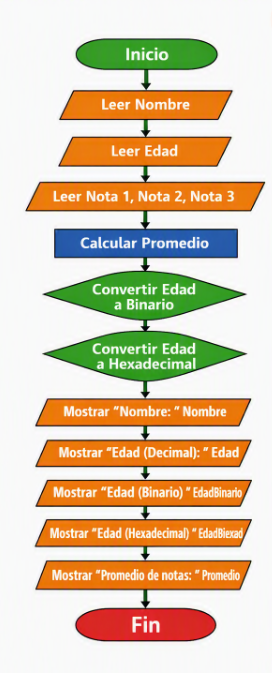

Este diagrama representa el flujo del programa que:
- Registra los datos básicos del estudiante.
- Calcula el promedio de las notas.
- Convierte la edad a binario y hexadecimal.
- Muestra los resultados en pantalla.

