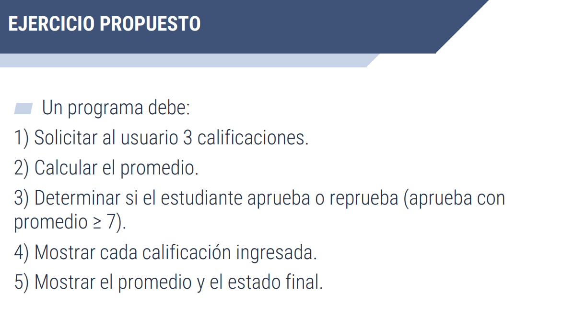

Desarrollar un algoritmo que permita ingresar tres calificaciones de un estudiante, calcular su promedio y determinar si aprueba o reprueba, mostrando además las calificaciones y el resultado final. 
