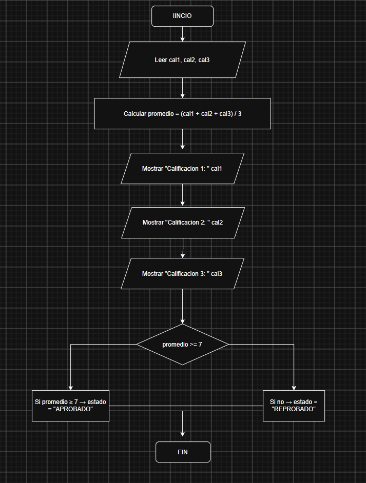

Flujograma – Ejercicio 2

Este flujograma representa el proceso del Ejercicio 3.  
Nota: Aquí se muestran los pasos principales de entrada, proceso y salida.

El diagrama refleja cómo se reciben los datos, se procesan y finalmente se muestran los resultados. Es útil para visualizar la lógica antes de escribir el pseudocódigo.

